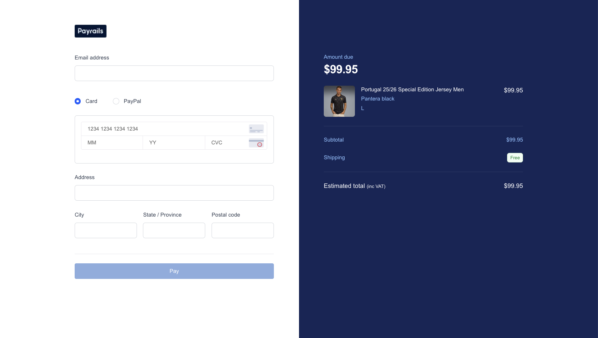

<div align="center">
  <h1>Payrails Elements – Getting Started Demo (Next.js)</h1>
  <p>A minimal, step-by-step example showing how to initialize the Payrails Web SDK, mount a Card Form + Payment Button, enrich the workflow with customer info, and redirect on success/failure.</p>
</div>

> This repository is intentionally simplified for documentation & onboarding. It is NOT production ready. Each file highlights the core integration steps with inline `STEP` markers.

## Quick Start


Prerequisites: Node 18+, a Payrails workspace, and API credentials.

1. Clone & install
	```bash
	pnpm install # or npm / yarn / bun
	```
2. Copy your env template
	```bash
	cp .env.example .env.local
	```
3. Fill in `.env.local` (see `.env.example`):
	- `PAYRAILS_CLIENT_ID` – server OAuth client id
	- `PAYRAILS_CLIENT_SECRET` – server OAuth secret (never expose with NEXT_PUBLIC_)
	- `PAYRAILS_WORKSPACE_ID` – non‑secret workspace id
	- `PAYRAILS_BASE_URL` – override API base (sandbox/staging)
4. Run the dev server
	```bash
	pnpm dev
	```
5. Open http://localhost:3000

## Integration Flow Overview

| Step | What Happens | Where |
|------|--------------|-------|
| 0 | Collect email + address inputs | `EmailField`, `AddressFields` (composed by `PaymentAndShipping`) |
| 1 | Render payment UX wrapper | `PaymentDetails` |
| 1a | Payment method selection (card / paypal) | `PaymentMethodSelector` (state lifted to `PaymentAndShipping`) |
| 1b | Card form mount target appears | `CardPaymentContainer` |
| 1c | PayPal placeholder (future element) | `PayPalPlaceholder` |
| 1e | Payment button mount target appears | `PaymentButton` |
| 2 | Subtotal derivation & pass to hook | `PaymentAndShipping` |
| 3.1 | Fetch init payload (OAuth + workflow init) | `app/api/init/route.ts` via `usePayrailsElements` |
| 3.2 | Initialize SDK client | `usePayrailsElements` |
| 3.3 | Mount card form (if method === card) | `usePayrailsElements` (targets `CardPaymentContainer`) |
| 3.4 | Mount payment button | `usePayrailsElements` (targets `PaymentButton`) |
| 4 | Pre-authorization enrichment (lookup) | `usePayrailsElements` / `app/api/lookup/route.ts` |
| 5 | Authorization result → redirect | `usePayrailsElements` → success/failure pages |

## Environment Variables

| Variable | Required | Scope | Description |
|----------|----------|-------|-------------|
| `PAYRAILS_CLIENT_ID` | Yes | Server | OAuth client id used by `/api/init` for token exchange. |
| `PAYRAILS_CLIENT_SECRET` | Yes | Server (secret) | OAuth client secret (never exposed client-side). |
| `PAYRAILS_WORKSPACE_ID` | Yes | Client | Primary workspace id. Non-secret. |
| `PAYRAILS_BASE_URL` | Optional | Server | API base override (sandbox/staging). |

Only variables prefixed with `NEXT_PUBLIC_` are bundled for the client. Restart the dev server after changes. Never prefix secrets with `NEXT_PUBLIC_`.

## Files & Responsibilities

- `app/hooks/usePayrailsElements.ts` – Core integration logic (init, mount, enrichment, redirects). STEP markers: `3`, `3.1–3.4`, `4`.
- `app/components/PaymentAndShipping.tsx` – Orchestrates form state, subtotal, gating. STEP `0` (collection & enable conditions).
- `app/components/EmailField.tsx` – Email input component. STEP `0a`.
- `app/components/AddressFields.tsx` – Address inputs grid. STEP `0b`.
- `app/components/PaymentDetails.tsx` – Wrapper for payment method UX. STEP `1`.
- `app/components/PaymentMethodSelector.tsx` – Radio group for method selection. STEP `1a`.
- `app/components/CardPaymentContainer.tsx` – Card form mount target & status UI. STEP `1b`.
- `app/components/PayPalPlaceholder.tsx` – Placeholder for future PayPal element. STEP `1c`.
- `app/components/PaymentButton.tsx` – Payment button mount container. STEP `1e`.
- `app/components/OrderSummary.tsx` – Minimal subtotal display (demo only).
- `app/api/init/route.ts` – Server-side OAuth + init; STEP `3`, `3.1`, `3.2`.
- `app/api/lookup/route.ts` – Workflow enrichment; STEP `4`, `4.1`, `4.2`.
- `app/order/success/page.tsx` / `app/order/failure/page.tsx` – Simple redirect targets.

## Inline Step Markers

Markers (e.g. `// STEP 3.2`) align with the flow table for tutorial extraction.

| Marker | Meaning |
|--------|---------|
| `0`, `0a`, `0b` | Collect & componentize customer inputs |
| `1`, `1a`–`1e` | Payment method selection & mount targets |
| `2` | Subtotal derivation (implicit) |
| `3.1`–`3.4` | Init request, SDK init, card form mount, payment button mount |
| `4` | Pre-authorization enrichment (lookup) |
| `5` | Authorization outcome & redirect |

## `usePayrailsElements` Hook API

### Purpose
Orchestrates Payrails workflow initialization, mounts the Card Form + Payment Button, performs optional enrichment, and handles authorization redirects.

### Options

| Option | Required | Type | Default | Description |
|--------|----------|------|---------|-------------|
| `amount` | Yes | `number` | — | In currency major unit. |
| `currency` | Yes | `string` | — | ISO 4217 currency code. |
| `workflowCode` | No | `string` | `payment-acceptance` | Payrails workflow to execute. |
| `workspaceId` | No | `string` | Env resolution | Override workspace id (usually rely on env). |
| `holderReference` | No | `string` | `'holder-abc'` | Merchant customer identifier. |
| `enabled` | No | `boolean` | `true` | Gating flag to defer initialization until ready. |
| `paymentMethod` | No | `'card' | 'paypal'` | — | Selected method; drives conditional Card Form mount. |
| `customerInfoProvider` | No | `() => { email; address; city; region; postal } | null` | — | Provides enrichment data just before authorization. |

### Return Shape

| Field | Type | Description |
|-------|------|-------------|
| `status` | `'idle' | 'loading' | 'ready' | 'error'` | Lifecycle state: pre-init, fetching/mounting, mounted, or failed. |
| `error` | `string | null` | Error message when `status === 'error'`. |
| `mountCardFormRef` | `(el: HTMLDivElement | null) => void` | Assign to empty `div` that should host the Card Form element. |
| `mountPaymentButtonRef` | `(el: HTMLDivElement | null) => void` | Assign to empty `div` that should host the Payment Button element. |
| `executionId` | `string | null` | Workflow execution identifier (set post-init via SDK event). |

### Status Transition
`idle` → (gated conditions satisfied) → `loading` → (`ready` on success | `error` on failure).

### Minimal Usage Example
```tsx
const { status, error, mountCardFormRef, mountPaymentButtonRef, executionId } = usePayrailsElements({
	amount: 99.95,
	currency: 'USD',
	paymentMethod,
	enabled: Boolean(paymentMethod),
	customerInfoProvider: () => ({ email, address, city, region, postal })
})

return (
	<div>
		<div ref={mountCardFormRef} id="card-form-container" />
		<div ref={mountPaymentButtonRef} id="payment-button-container" />
		{status === 'error' && <p className="text-red-600">{error}</p>}
	</div>
)
```

## Enrichment (Lookup) Rationale
The optional lookup call lets you attach metadata (customer email, billing address, amount) to the workflow *before* authorization. This is useful for:
- Fraud/risk evaluation
- Reporting / analytics
- Downstream reconciliation

If lookup fails the demo blocks authorization (returns `false`) to surface the issue during learning. In production you might log & proceed instead.

## Production Hardening Checklist (Not Implemented Here)

- Server‑side authoritative pricing & currency handling
- Robust validation & user messaging
- Auth/session layer for API routes
- Secret management & rotation
- Retry / backoff for transient network errors
- Observability (structured logs, tracing, metrics)
- Accessibility & localization (ARIA, translations, currency formatting)

## Merchant Reference
Generated client-side via timestamp for simplicity. In production:
1. Generate the order reference server-side.
2. Persist before payment initiation.
3. Re-use consistently across authorization, capture, and reconciliation.

## Troubleshooting FAQ

| Issue | Likely Cause | Resolution |
|-------|--------------|------------|
| Payment Button never appears | `enabled` false or container not rendered | Ensure `paymentMethod` is selected and `enabled` prop passed as true before mount. Confirm `<div id="payment-button-container" ref={mountPaymentButtonRef} />` exists. |
| Card Form not mounting | Missing `paymentMethod === 'card'` or wrong container id | Set payment method to `card` and include `<div id="card-form-container" ref={mountCardFormRef} />`. Ids must match those used by the hook. |
| Status stuck at `loading` | Init request hanging or network issue | Check Network tab for `/api/init` POST. Verify env vars (`PAYRAILS_CLIENT_ID/SECRET` & workspace id) are correct. |
| `Initialization failed` error | Non‑200 from `/api/init` | Inspect server logs / route implementation; validate credentials & workflow code. |
| Lookup enrichment not called | `customerInfoProvider` returns null or `executionId` not set yet | Ensure provider returns an object and that authorization only proceeds after `status === 'ready'`. |
| Wrong workspace used | Missing `NEXT_PUBLIC_PAYRAILS_WORKSPACE_ID` | Add it to `.env.local` or pass `workspaceId` override into hook options. |
| Double initialization | Containers unmounted/remounted rapidly | Keep mount targets stable; hook guards with `initializedRef`, but rapid unmount may prevent detection. |
| Styling missing on button | Tailwind classes applied post-mount timing | Inspect button after a short delay; adjust styling logic inside `setTimeout` if customizing. |

Debug tips:
- Add `console.log(status, executionId)` inside your component to trace lifecycle.
- Use browser DevTools > Network to confirm `/api/init` (STEP 3.1) and `/api/lookup` (STEP 4) calls.
- Temporarily remove enrichment (set `customerInfoProvider` to `null`) to isolate init vs enrichment failures.

## Scripts
```bash
pnpm dev     # Start dev server
pnpm build   # Production build
pnpm start   # Run built app
```

## License
Provided as-is for instructional purposes. Embed or adapt freely in your docs or prototypes.

---
Happy building with Payrails! ✨
