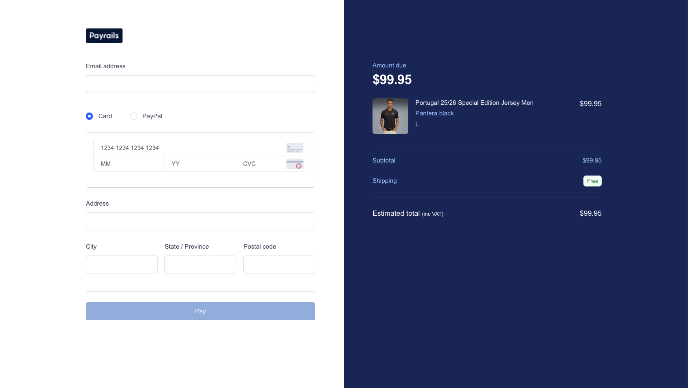

<div align="center">
  <h1>Payrails Elements – Getting Started Demo (Next.js)</h1>
  <p>A minimal, step-by-step example showing how to initialize the Payrails Web SDK, mount payment elements (Card Form, Express Checkout, Pix), and redirect on success/failure.</p>
</div>

> This repository is intentionally simplified for documentation & onboarding. It is NOT production ready.

## Quick Start


Prerequisites: Node 18+, a Payrails workspace, and API credentials.

1. Clone & install
	```bash
	pnpm install # or npm / yarn / bun
	```
2. Copy your env template
	```bash
	cp .env.example .env.local
	```
3. Fill in `.env.local` (see `.env.example`):
	- `PAYRAILS_CLIENT_ID` – server OAuth client id
	- `PAYRAILS_CLIENT_SECRET` – server OAuth secret (never expose with NEXT_PUBLIC_)
	- `PAYRAILS_WORKSPACE_ID` – non‑secret workspace id
	- `PAYRAILS_BASE_URL` – override API base (sandbox/staging)
4. Run the dev server
	```bash
	pnpm dev                      # HTTP (card payments work)
	pnpm dev --experimental-https # HTTPS (required for Apple Pay / Google Pay)
	```
5. Open http://localhost:3000 (or https://localhost:3000 for HTTPS)

## Integration Flow Overview

| Step | What Happens | Where |
|------|--------------|-------|
| 1 | Render express checkout buttons | `ExpressCheckoutButtonContainer` (Apple Pay, Google Pay, PayPal) |
| 2 | Payment method selection via tabs | `PaymentMethodSelector` (Card / Pix / UPI) |
| 3 | Card form mount target appears | `CardPaymentContainer` |
| 4 | Pix redirect button mount target | `PixElement` |
| 5 | Payment button mount target appears | `PaymentButton` |
| 6 | Subtotal derivation & pass to hook | `PaymentAndShipping` |
| 7 | Fetch init payload (OAuth + workflow init) | `app/api/init/route.ts` via `usePayrailsElements` |
| 8 | Initialize SDK client | `usePayrailsElements` |
| 9 | Mount all payment elements | `usePayrailsElements` (card form, express checkout, Pix, payment button) |
| 10 | Authorization result → redirect | `usePayrailsElements` → success/failure pages |

## Environment Variables

| Variable | Required | Scope | Description |
|----------|----------|-------|-------------|
| `PAYRAILS_CLIENT_ID` | Yes | Server | OAuth client id used by `/api/init` for token exchange. |
| `PAYRAILS_CLIENT_SECRET` | Yes | Server (secret) | OAuth client secret (never exposed client-side). |
| `PAYRAILS_WORKSPACE_ID` | Yes | Server | Primary workspace id. Non-secret, used in API routes. |
| `PAYRAILS_BASE_URL` | Optional | Server | API base override (sandbox/staging). |

Restart the dev server after changes to `.env.local`. Never prefix secrets with `NEXT_PUBLIC_`.

## Files & Responsibilities

- `app/hooks/usePayrailsElements.ts` – Core integration logic (init, mount all elements, redirects).
- `app/components/PaymentAndShipping.tsx` – Orchestrates form state and subtotal derivation.
- `app/components/ExpressCheckoutButtonContainer.tsx` – Express checkout buttons (Apple Pay, Google Pay, PayPal).
- `app/components/PaymentDetails.tsx` – Wrapper for payment method UX (tabs + card form + Pix).
- `app/components/PaymentMethodSelector.tsx` – Tab-based payment method selector with icons.
- `app/components/CardPaymentContainer.tsx` – Card form mount target & status UI.
- `app/components/PixElement.tsx` – Pix redirect button mount target (Brazilian instant payments).
- `app/components/PaymentButton.tsx` – Payment button mount container.
- `app/api/init/route.ts` – Server-side OAuth + workflow initialization.
- `app/order/success/page.tsx` / `app/order/failure/page.tsx` – Redirect targets after authorization.

## Supported Payment Methods

### Express Checkout
Express checkout buttons appear at the top of the payment form for quick checkout:
- **Apple Pay** – Native Apple Pay experience (requires HTTPS and compatible device/browser)
- **Google Pay** – Google Pay button (requires HTTPS and compatible browser)
- **PayPal** – PayPal express checkout button

### Standard Payment Methods (Tab Selector)
Users can select from these methods via a tab-based UI:
- **Card** – Credit/debit card form with secure input fields
- **Pix** – Brazilian instant payment system (redirect-based)
- **UPI** – Unified Payments Interface for India (placeholder)

## `usePayrailsElements` Hook API

### Purpose
Orchestrates Payrails workflow initialization, mounts all payment elements (Card Form, Express Checkout buttons, Pix, Payment Button), and handles authorization redirects.

### Options

| Option | Required | Type | Default | Description |
|--------|----------|------|---------|-------------|
| `amount` | Yes | `number` | — | Amount in minor units (e.g., 9995 = $99.95). |
| `currency` | Yes | `string` | — | ISO 4217 currency code. |
| `workflowCode` | No | `string` | `payment-acceptance` | Payrails workflow to execute. |
| `workspaceId` | No | `string` | Env resolution | Override workspace id (usually rely on env). |
| `holderReference` | No | `string` | `'holder-abc'` | Merchant customer identifier. |
| `paymentMethod` | No | `'card' \| 'pix' \| 'upi'` | — | Selected method; drives conditional element mounting. |

### Return Shape

| Field | Type | Description |
|-------|------|-------------|
| `status` | `'idle' \| 'loading' \| 'ready' \| 'error'` | Lifecycle state: pre-init, fetching/mounting, mounted, or failed. |
| `error` | `string \| null` | Error message when `status === 'error'`. |
| `mountCardFormRef` | `(el: HTMLDivElement \| null) => void` | Assign to empty `div` that should host the Card Form element. |
| `mountPaymentButtonRef` | `(el: HTMLDivElement \| null) => void` | Assign to empty `div` that should host the Payment Button element. |
| `mountApplePayButtonRef` | `(el: HTMLDivElement \| null) => void` | Assign to empty `div` for Apple Pay button. |
| `mountGooglePayButtonRef` | `(el: HTMLDivElement \| null) => void` | Assign to empty `div` for Google Pay button. |
| `mountPayPalButtonRef` | `(el: HTMLDivElement \| null) => void` | Assign to empty `div` for PayPal button. |
| `mountPixButtonRef` | `(el: HTMLDivElement \| null) => void` | Assign to empty `div` for Pix redirect button. |
| `executionId` | `string \| null` | Workflow execution identifier (set post-init via SDK event). |

### Status Transition
`idle` → (gated conditions satisfied) → `loading` → (`ready` on success | `error` on failure).

### Minimal Usage Example
```tsx
const {
  status,
  error,
  mountCardFormRef,
  mountPaymentButtonRef,
  mountApplePayButtonRef,
  mountGooglePayButtonRef,
  mountPayPalButtonRef,
  mountPixButtonRef,
} = usePayrailsElements({
  amount: 9995, // $99.95 in minor units
  currency: 'USD',
  paymentMethod: 'card',
  holderReference: 'customer-123',
})

return (
  <div>
    {/* Express Checkout */}
    <div ref={mountApplePayButtonRef} id="apple-pay-button-container" />
    <div ref={mountGooglePayButtonRef} id="google-pay-button-container" />
    <div ref={mountPayPalButtonRef} id="paypal-button-container" />

    {/* Card Payment */}
    <div ref={mountCardFormRef} id="card-form-container" />
    <div ref={mountPaymentButtonRef} id="payment-button-container" />

    {/* Pix Payment */}
    <div ref={mountPixButtonRef} id="pix-button-container" />

    {status === 'error' && <p className="text-red-600">{error}</p>}
  </div>
)
```

## HTTPS Requirement

Express checkout methods (Apple Pay, Google Pay) require HTTPS to function. For local development:
- Use `pnpm dev --experimental-https` to enable HTTPS on localhost
- Accept the self-signed certificate in your browser

## Production Hardening Checklist (Not Implemented Here)

- Server‑side authoritative pricing & currency handling
- Robust validation & user messaging
- Auth/session layer for API routes
- Secret management & rotation
- Retry / backoff for transient network errors
- Observability (structured logs, tracing, metrics)
- Accessibility & localization (ARIA, translations, currency formatting)

## Merchant Reference
Generated client-side via timestamp for simplicity. In production:
1. Generate the order reference server-side.
2. Persist before payment initiation.
3. Re-use consistently across authorization, capture, and reconciliation.

## Troubleshooting FAQ

| Issue | Likely Cause | Resolution |
|-------|--------------|------------|
| Payment Button never appears | Container not rendered | Confirm `<div id="payment-button-container" ref={mountPaymentButtonRef} />` exists. |
| Card Form not mounting | Missing `paymentMethod === 'card'` or wrong container id | Set payment method to `card` and include `<div id="card-form-container" ref={mountCardFormRef} />`. |
| Apple Pay / Google Pay not showing | Not using HTTPS or unsupported device/browser | Run with `pnpm dev --experimental-https`. Apple Pay requires Safari on macOS/iOS. |
| Pix button not appearing | Container not rendered or wrong id | Ensure `<div id="pix-button-container" ref={mountPixButtonRef} />` exists when Pix is selected. |
| Status stuck at `loading` | Init request hanging or network issue | Check Network tab for `/api/init` POST. Verify env vars (`PAYRAILS_CLIENT_ID/SECRET` & workspace id) are correct. |
| `Initialization failed` error | Non‑200 from `/api/init` | Inspect server logs / route implementation; validate credentials & workflow code. |
| Wrong workspace used | Missing `PAYRAILS_WORKSPACE_ID` | Add it to `.env.local` or pass `workspaceId` override into hook options. |
| Double initialization | Containers unmounted/remounted rapidly | Keep mount targets stable; hook guards with `initializedRef`, but rapid unmount may prevent detection. |
| Express checkout buttons overlapping | Missing CSS for button containers | Ensure containers have proper sizing classes like `[&>*]:w-full [&>*]:h-11`. |

Debug tips:
- Add `console.log(status, executionId)` inside your component to trace lifecycle.
- Use browser DevTools > Network to confirm `/api/init` POST call succeeds.
- Check browser console for SDK initialization errors.

## Scripts
```bash
pnpm dev                      # Start dev server (HTTP)
pnpm dev --experimental-https # Start dev server with HTTPS (required for Apple Pay/Google Pay)
pnpm build                    # Production build
pnpm start                    # Run built app
```

## License
Provided as-is for instructional purposes. Embed or adapt freely in your docs or prototypes.

---
Happy building with Payrails! ✨
